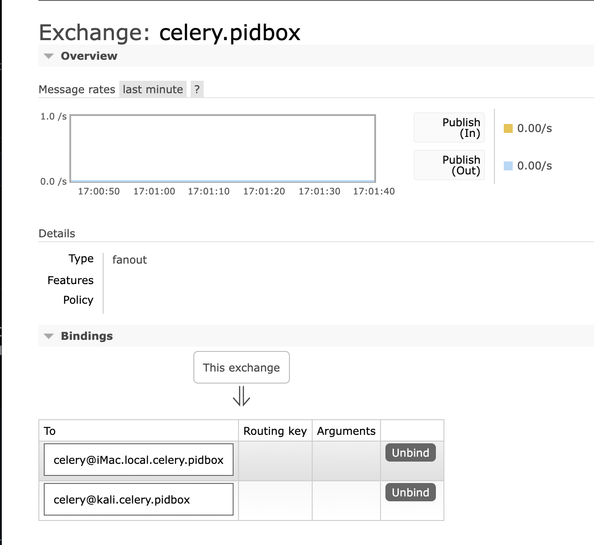

# pickled-celery
scripts and a short writeup on how to attack celery workers that accept pickle serialized messages.

# Details
Skimming through Celery's source code and docs, i noticed that pickle can be used to serialize messages (e.g: tasks requests/results), but the workers has to actually whitelist it in celery config (`CELERY_ACCEPT_CONTENT`).

to exploit Celery workers, you can either send pickle serialized tasks messages and every available worker will pop a task from the queue and try to execute it, or better send a single pickle serialized control message (same as running: `celery inspect ping`) and every worker will receive a copy of the pickle serialized message, this works because Celery creates a [fanout exchange](https://www.cloudamqp.com/blog/rabbitmq-fanout-exchange-explained.html) (name: `celery.pidbox`) on AMQP, and every worker creates and binds its own queue to the exchange at startup.

here is an example from a local setup of Celery, two workers:

so when you run for example `celery inspect ping` a single message is sent to the exchnage, and because its type is `fanout` it routes the message to every bound queue, which means every worker.
the only problem is non recent celery workers (before [PR #6757](https://github.com/celery/celery/pull/6757)) accept only JSON as the serializer for control messages even if the app config accepts `pickle`. so if you send a pickle serialized message it will not be deserialized (which was the case for my target, running Celery v4.4.2).

you can overcome this by first sending pickle serialized tasks that makes the worker accepts `pickle` for control messages ([`whitelist_pickle_task.py`](whitelist_pickle_task.py)), then you can send pickle serialized control messages just like recent versions ([`pickled_control_message.py`](pickled_control_message.py)), or you can just send pickle serialized messages as tasks and will be poped by some available worker ([`pickled_task.py`](pickled_task.py)).

NOTE: because tasks are published to queues, some workers might race and execute 2 tasks, so for more reliability you can send `workers_count + N` tasks.
